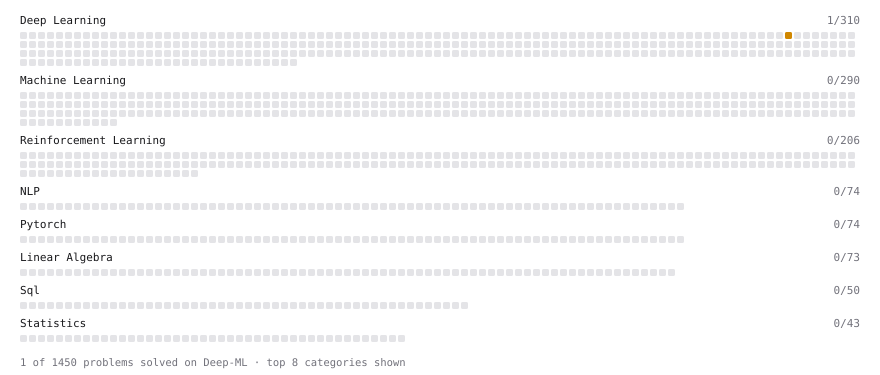

# Deep-ML

My machine learning practice from [Deep-ML](https://www.deep-ml.com). Every solution here was written by hand.

**5** solved · 5 problems · 0 labs · 0 math

[**Browse the interactive portfolio**](https://lanceyliao.github.io/deep-ml/) to replay this filling in over time.

## Problems

| | Difficulty | Solved | |
| --- | --- | --- | --- |
| [Diffusion Model U-Net Time Embedding](https://www.deep-ml.com/problems/399) | medium | 2026-09-26 | [solution](problems/0399-diffusion-model-u-net-time-embedding) |
| [Dropout Layer](https://www.deep-ml.com/problems/151) | medium | 2026-09-28 | [solution](problems/0151-dropout-layer) |
| [Forward Diffusion Process](https://www.deep-ml.com/problems/303) | medium | 2026-09-25 | [solution](problems/0303-forward-diffusion-process) |
| [Poisson Deviance and Overdispersion](https://www.deep-ml.com/problems/1367) | medium | 2026-09-29 | [solution](problems/1367-poisson-deviance-and-overdispersion) |
| [Successor Representation Learning](https://www.deep-ml.com/problems/597) | hard | 2026-09-30 | [solution](problems/0597-successor-representation-learning) |

---

_This file is regenerated by Deep-ML on every push._
